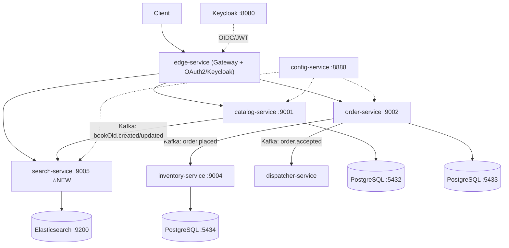

# 🎯 Lộ Trình Senior Java/Spring — spring-native-bookstore

> **Triết lý:** Build → Break → Fix → Refactor. Đây là repo của bạn — mọi task đều là việc xây thêm, không phải học lại từ đầu.

---

## 📊 Target Architecture (sau khi hoàn thiện)



**Stack:** Java 21 · Spring Boot 4.0.3 · Spring Cloud 2025.1.0 · Kafka · PostgreSQL · Elasticsearch · Redis · Keycloak · K8s · ArgoCD · GitHub Actions

---

## 🗺️ Roadmap — 6 Giai Đoạn

---

### Giai Đoạn 1 — Hoàn Thiện inventory-service ✅ (Đang làm)
> Giai đoạn này vẫn giữ vì inventory chưa xong, không phải học lại.

- [ ] **1.1 Domain Layer:** Enforce reservation invariants (all-or-nothing, idempotency theo `orderId`)
- [ ] **1.2 Persistence (jOOQ):** Implement `StockReservationRepository`, xử lý concurrency với `SELECT FOR UPDATE`
- [ ] **1.3 Event Consumer:** Handle `order-accepted` → reserve, `order-cancelled` → release
- [ ] **1.4 Integration Tests:** Testcontainers PostgreSQL + Spring Cloud Stream Test Binder

---

### Giai Đoạn 2 — Search Service ⭐ (Mới hoàn toàn)
> Xây `search-service` từ đầu — service mới nhất, thú vị nhất.

**Stack:** Spring Boot + Spring Data Elasticsearch + Kafka Consumer

- [ ] **2.1 Bootstrap project:** Tạo `search-service` theo Hexagonal structure của `order-service`
  ```
  search-service/
  ├── domain/         ← BookDocument, SearchQuery, SearchResult
  ├── application/
  │   ├── port/       ← BookIndexPort, SearchPort
  │   └── service/    ← BookIndexService, SearchService
  ├── adapter/
  │   ├── in/         ← SearchController, BookEventConsumer
  │   └── out/        ← ElasticsearchBookRepository
  └── bootstrap/      ← Spring config
  ```
- [ ] **2.2 Elasticsearch mapping:** Định nghĩa `BookDocument` với analyzers tiếng Anh:
  ```java
  @Document(indexName = "books")
  public record BookDocument(
      @Id String isbn,
      @MultiField(mainField = @Field(type = FieldType.Text, analyzer = "english"),
                  otherFields = @InnerField(suffix = "keyword", type = FieldType.Keyword))
      String title,
      String author,
      String description,
      BigDecimal price,
      // ...
  ) {}
  ```
- [ ] **2.3 Kafka Consumer:** Lắng nghe `bookOld.created` và `bookOld.updated` từ `catalog-service` → index vào Elasticsearch
- [ ] **2.4 Search API:** Implement các endpoints:
  - `GET /search?q=spring&page=0&size=10` — full-text search
  - `GET /search?author=vitale&sort=price,asc` — filter + sort
  - `GET /search/suggest?q=spr` — autocomplete
- [ ] **2.5 Highlight:** Trả về highlighted snippets trong kết quả tìm kiếm
- [ ] **2.6 catalog-service phát event:** Thêm Kafka publisher vào `catalog-service` khi bookOld được tạo/cập nhật/xóa
- [ ] **2.7 Tests:** Integration test với Testcontainers Elasticsearch

**Verify:**
```bash
# Index một cuốn sách qua catalog, search qua search-service
curl "http://localhost:9005/search?q=spring+boot"
# Kỳ vọng: trả về danh sách books có highlight
```

---

### Giai Đoạn 3 — Security Hoàn Chỉnh (Vitale Ch.11–14 style)

> **Phân tích thực tế edge-service hiện tại:**
> - ✅ **Có rồi:** OAuth2 Client (Authorization Code + OIDC), CSRF cookie, Redis session, Rate Limiter, TokenRelay filter, OIDC Logout, Circuit Breaker
> - ❌ **Chưa có / thiếu:** Refresh Token handling, PKCE, Token Relay hiểu sâu, downstream JWT validation, Security Headers đầy đủ, Role-based ở method level, Token introspection, BFF pattern hoàn chỉnh

#### 3.A — Hiểu Sâu OAuth2 Flows (Lý thuyết phải biết trước khi code)

**OAuth2 Flows trong dự án này:**
```
edge-service dùng: Authorization Code Flow + OIDC (không phải Resource Server!)

Browser → edge-service (OAuth2 Client) → Keycloak → Authorization Code
edge-service đổi code lấy: Access Token + Refresh Token + ID Token (OIDC)
edge-service lưu tokens trong Redis Session (đã config: session.store-type: redis)
Downstream requests: edge-service relay Access Token qua TokenRelay filter
```

- [ ] **3.A.1 Phân biệt 3 loại token:**
  | Token | Lifetime | Dùng cho |
  |-------|----------|----------|
  | **Access Token** (JWT) | 5 phút | Gọi API downstream — stateless |
  | **Refresh Token** (opaque) | 30 phút | Lấy Access Token mới khi hết hạn — stateful ở Keycloak |
  | **ID Token** (JWT, OIDC) | 5 phút | Thông tin user cho edge-service, không gửi downstream |

- [ ] **3.A.2 Hiểu TokenRelay filter** (line 39 trong `config/edge-service.yml`):
  - `TokenRelay` tự động lấy Access Token từ Redis Session → thêm vào `Authorization: Bearer <token>` header downstream
  - Nếu Access Token hết hạn → Spring Security tự động dùng Refresh Token gọi Keycloak để lấy Access Token mới → lưu lại vào Redis Session
  - Bài tập: Set Keycloak Access Token lifetime = 1 phút, đặt breakpoint, verify flow refresh hoạt động

- [ ] **3.A.3 BFF Pattern (Backend For Frontend):**
  ```
  Browser ←→ edge-service (giữ tokens trong server-side Redis Session)
                    ↕ (chỉ trả về session cookie cho browser, KHÔNG trả token về browser)
             downstream services (nhận Access Token qua TokenRelay)
  ```
  Tại sao quan trọng: **Token không bao giờ lộ ra browser** → tránh XSS steal token

#### 3.B — Những Thứ Cần Implement Thêm

- [ ] **3.B.1 PKCE (Proof Key for Code Exchange):** Bảo vệ Authorization Code bị intercept
  ```yaml
  # config/edge-service.yml
  spring.security.oauth2.client.registration.keycloak:
    authorization-grant-type: authorization_code
    # Spring Security 6+ tự bật PKCE cho public clients — verify đang hoạt động
  ```
  Verify: Xem network request trong browser DevTools → tìm `code_challenge` trong redirect URL đến Keycloak

- [ ] **3.B.2 Refresh Token Rotation:** Cấu hình Keycloak bật Refresh Token Rotation
  - Mỗi lần dùng Refresh Token → Keycloak cấp Refresh Token mới + revoke cái cũ
  - Nếu Refresh Token cũ bị dùng lại → Keycloak phát hiện tấn công, revoke toàn bộ session

- [ ] **3.B.3 Token Validation ở Downstream Services:**
  ```java
  // catalog-service, order-service cần thêm:
  implementation 'org.springframework.boot:spring-boot-starter-oauth2-resource-server'
  ```
  ```yaml
  # config/catalog-service.yml
  spring.security.oauth2.resourceserver.jwt.issuer-uri: ${KEYCLOAK_URL}/realms/PolarBookshop
  ```
  Verify: Gọi trực tiếp `catalog-service:9001` không qua edge → nếu không có JWT → 401

- [ ] **3.B.4 Keycloak Realm Setup hoàn chỉnh:**
  - Realm: `PolarBookshop`
  - Client `edge-service`: Authorization Code + PKCE, redirect URIs, post-logout URIs
  - Roles: `customer`, `employee` (realm roles, không phải client roles)
  - Users: `bjorn`/`bjorn` (employee), `isabelle`/`isabelle` (customer)
  - Mapper: thêm custom mapper để đưa `roles` vào JWT claim (Vitale dùng `roles` claim, không phải `realm_access`)

- [ ] **3.B.5 Role-based Access Control:**
  ```java
  // SecurityConfig.java — thêm role check
  .pathMatchers(HttpMethod.POST, "/books/**").hasRole("employee")
  .pathMatchers(HttpMethod.PUT, "/books/**").hasRole("employee")
  .pathMatchers(HttpMethod.DELETE, "/books/**").hasRole("employee")
  .pathMatchers(HttpMethod.POST, "/orders/**").hasAnyRole("customer", "employee")
  .pathMatchers(HttpMethod.GET, "/orders/**").authenticated()
  ```
  Và custom `GrantedAuthoritiesMapper` để map Keycloak `roles` claim → Spring Security roles:
  ```java
  @Bean
  GrantedAuthoritiesMapper authoritiesMapper() {
      return authorities -> authorities.stream()
          .filter(a -> a instanceof OidcUserAuthority)
          .map(a -> (OidcUserAuthority) a)
          .flatMap(a -> ((List<String>) a.getUserInfo().getClaim("roles")).stream())
          .map(role -> new SimpleGrantedAuthority("ROLE_" + role))
          .collect(Collectors.toSet());
  }
  ```

- [ ] **3.B.6 OIDC Logout hoàn chỉnh** (đã có skeleton, cần verify):
  - Verify `OidcClientInitiatedServerLogoutSuccessHandler` hoạt động đúng
  - Sau logout: Keycloak session bị destroy, Redis session bị xóa, browser redirect về `/`
  - Test: login → đặt hàng → logout → thử dùng session cũ → 401

- [ ] **3.B.7 Security Headers** (chưa có trong code):
  ```java
  .headers(headers -> headers
      .frameOptions(frame -> frame.deny())
      .contentSecurityPolicy(csp -> csp.policyDirectives(
          "default-src 'self'; script-src 'self'; style-src 'self' 'unsafe-inline'"))
      .referrerPolicy(ref -> ref.policy(ReferrerPolicyServerHttpHeadersWriter.ReferrerPolicy.STRICT_ORIGIN))
      .permissionsPolicy(perm -> perm.policy("camera=(), microphone=(), geolocation=()")))
  ```

- [ ] **3.B.8 User context propagation xuống downstream:**
  - `UserController.java` đã extract user info từ OIDC — cần propagate `userId` qua custom header
  - Thêm Gateway filter inject `X-User-Id` header từ session vào downstream requests
  - `order-service` đọc `X-User-Id` header → gán vào `Order.createdBy`

#### 3.C — Testing Security

- [ ] **3.C.1 Unit tests cho SecurityConfig:**
  ```java
  @WebFluxTest
  @Import(SecurityConfig.class)
  class SecurityConfigTest {
      @Test void unauthenticated_should_return_401_for_protected_routes() { ... }
      @Test void employee_can_create_book() { ... }
      @Test void customer_cannot_create_book() { ... }
  }
  ```
- [ ] **3.C.2 Keycloak Testcontainers** cho integration tests:
  ```java
  @Container
  static KeycloakContainer keycloak = new KeycloakContainer("quay.io/keycloak/keycloak:24.0")
      .withRealmImportFile("test-realm.json");
  ```
- [ ] **3.C.3 Verify downstream protection:** Test gọi trực tiếp `catalog-service` bypass edge → 401

#### 3.D — Rate Limiting (đã có, cần hiểu sâu)

- [ ] `RequestRateLimiter` đang dùng Redis Token Bucket (10 req/s, burst 20) — đọc hiểu config
- [ ] Custom `KeyResolver`: hiện tại rate limit theo gì? (IP hay user?) → implement per-user rate limiting:
  ```java
  @Bean
  KeyResolver userKeyResolver() {
      return exchange -> ReactiveSecurityContextHolder.getContext()
          .map(ctx -> ctx.getAuthentication().getName())
          .defaultIfEmpty("anonymous");
  }
  ```
- [ ] Test: script gửi 25 requests liên tiếp → verify request 21-25 nhận 429 Too Many Requests

---

---

### Giai Đoạn 4 — Production Patterns (technology.md)
> Implement các patterns trong `technology.md`.

- [ ] **4.1** Global Exception Handling + Validation (RFC 7807 Problem Details)
- [ ] **4.2** Structured Logging — JSON output với MDC (`traceId`, `userId`)
- [ ] **4.3** Outbox Pattern trong `order-service`
- [ ] **4.4** Circuit Breaker + Retry + Timeout với Resilience4j
- [ ] **4.5** Caching với Redis (Read-Through cho catalog, Write-Behind cho audit log)
- [ ] **4.6** Saga Pattern — PlaceOrder choreography với compensation
- [ ] **4.7** Distributed Tracing — OpenTelemetry → Grafana Tempo
- [ ] **4.8** Custom Metrics — Micrometer → Prometheus → Grafana dashboard

---

### Giai Đoạn 5 — GitOps (Vitale Ch.15 style)
> Đây là phần quan trọng nhất để deploy production như một Senior. Vitale Ch.15 dùng ArgoCD + GitHub Actions.

**GitOps Philosophy:**
> *"Git là source of truth duy nhất. Mọi thay đổi trên cluster phải đến từ Git commit, không ai `kubectl apply` tay."*

#### 5.1 Repository Structure (GitOps layout)
- [ ] Tạo repo riêng `polar-gitops` (hoặc folder `polar-deployment/gitops/`):
  ```
  polar-gitops/
  ├── applications/          ← ArgoCD Application manifests
  │   ├── catalog-service.yml
  │   ├── order-service.yml
  │   ├── search-service.yml
  │   └── ...
  ├── environments/
  │   ├── staging/           ← Helm values cho staging
  │   └── production/        ← Helm values cho production
  └── platform/              ← Keycloak, Kafka, PostgreSQL manifests
  ```

#### 5.2 CI Pipeline — GitHub Actions (build & push)
- [ ] **catalog-pipeline:** Trigger khi push vào `catalog-service/**`
  ```yaml
  # .github/workflows/ci-catalog-pipeline.yml
  jobs:
    build-and-push:
      steps:
        - run: ./gradlew test         # chạy tests
        - run: ./gradlew bootBuildImage  # build OCI image
        - run: docker push $ECR_REGISTRY/catalog-service:$SHA  # push
        - run: |
            # Update image tag trong GitOps repo → trigger ArgoCD
            yq e '.image.tag = "$SHA"' -i environments/staging/catalog-service/values.yml
            git commit -m "ci: bump catalog-service to $SHA"
  ```

#### 5.3 ArgoCD Setup
- [ ] Install ArgoCD vào Kubernetes cluster:
  ```bash
  kubectl create namespace argocd
  kubectl apply -n argocd -f https://raw.githubusercontent.com/argoproj/argo-cd/stable/manifests/install.yaml
  ```
- [ ] Tạo `Application` resource cho mỗi service:
  ```yaml
  apiVersion: argoproj.io/v1alpha1
  kind: Application
  metadata:
    name: catalog-service
    namespace: argocd
  spec:
    project: default
    source:
      repoURL: https://github.com/<you>/polar-gitops
      targetRevision: main
      path: environments/staging/catalog-service
      helm:
        valueFiles: [values.yml]
    destination:
      server: https://kubernetes.default.svc
      namespace: bookstore
    syncPolicy:
      automated:
        prune: true      # xóa resources không còn trong Git
        selfHeal: true   # tự rollback khi ai đó sửa tay trên cluster
  ```
- [ ] Cấu hình **sync policy:** auto-sync cho staging, manual approval cho production
- [ ] **Rollback:** Khi deploy lỗi → `argocd app rollback catalog-service` hoặc revert Git commit

#### 5.4 Helm Charts (Vitale style)
- [ ] Tạo Helm chart cho mỗi service với `values.yml` riêng cho staging/prod:
  ```yaml
  # environments/staging/catalog-service/values.yml
  image:
    repository: <ecr-url>/catalog-service
    tag: "abc123sha"   # CI tự update field này
  replicaCount: 1
  resources:
    requests: { cpu: 100m, memory: 256Mi }
    limits:   { cpu: 500m, memory: 512Mi }
  ```
- [ ] HorizontalPodAutoscaler cho `order-service` và `search-service`
- [ ] PodDisruptionBudget: đảm bảo ít nhất 1 pod running khi update

#### 5.5 Secrets Management (GitOps-safe)
- [ ] Không commit secrets vào Git — dùng **External Secrets Operator** hoặc **Sealed Secrets**:
  ```yaml
  # SealedSecret — mã hóa, safe to commit
  apiVersion: bitnami.com/v1alpha1
  kind: SealedSecret
  metadata:
    name: catalog-db-credentials
  spec:
    encryptedData:
      password: AgA...encrypted...
  ```
- [ ] Secrets được decrypt tự động bởi controller trong cluster

#### 5.6 Progressive Delivery (bonus)
- [ ] Canary deployment cho `catalog-service` dùng Argo Rollouts:
  - Deploy 10% traffic đến version mới
  - Nếu error rate < 1% sau 5 phút → promote 100%
  - Nếu error rate tăng → rollback tự động

---

### Giai Đoạn 6 — Knative Serverless (Vitale Ch.16 style)
> Chạy services dưới dạng serverless workloads trên Kubernetes — scale-to-zero, event-driven routing.
> Đây là bước cầu nối quan trọng giữa "K8s thuần" và "Cloud Native" thực sự trước khi lên AWS.

**Tại sao Knative trước AWS:**
- Knative chạy được trên local (Minikube) — test không tốn tiền AWS
- Hiểu Knative giúp bạn tận dụng tốt hơn AWS Lambda, Fargate, App Runner
- `dispatcher-service` là ứng viên hoàn hảo: stateless, event-triggered, scale-to-zero được

#### 6.1 Knative Serving — Deploy Services
- [ ] Cài Knative Serving vào cluster local:
  ```bash
  kubectl apply -f https://github.com/knative/serving/releases/download/knative-v1.14.0/serving-crds.yaml
  kubectl apply -f https://github.com/knative/serving/releases/download/knative-v1.14.0/serving-core.yaml
  ```
- [ ] Chuyển `dispatcher-service` sang Knative Service:
  ```yaml
  apiVersion: serving.knative.dev/v1
  kind: Service
  metadata:
    name: dispatcher-service
  spec:
    template:
      metadata:
        annotations:
          autoscaling.knative.dev/min-scale: "0"   # scale-to-zero khi không có traffic
          autoscaling.knative.dev/max-scale: "10"
          autoscaling.knative.dev/target: "100"    # 100 concurrent requests/pod
      spec:
        containers:
          - image: <registry>/dispatcher-service:latest
  ```
- [ ] Verify scale-to-zero: sau 90s không có request → pod tự xóa, khi có request → pod tự tạo lại
- [ ] Blue/Green deployment: Knative tự động hỗ trợ traffic splitting giữa revisions:
  ```yaml
  traffic:
    - revisionName: dispatcher-service-v1
      percent: 80
    - revisionName: dispatcher-service-v2
      percent: 20
  ```

#### 6.2 Knative Eventing — Event-driven Routing
- [ ] Cài Knative Eventing + Kafka integration:
  ```bash
  kubectl apply -f https://github.com/knative/eventing/releases/download/knative-v1.14.0/eventing-core.yaml
  kubectl apply -f https://github.com/knative-extensions/eventing-kafka-broker/releases/download/knative-v1.14.0/eventing-kafka-controller.yaml
  ```
- [ ] Tạo Kafka Broker — thay thế direct Kafka consumer trong một số services:
  ```yaml
  apiVersion: eventing.knative.dev/v1
  kind: Broker
  metadata:
    name: bookstore-broker
    annotations:
      eventing.knative.dev/broker.class: Kafka
  spec:
    config:
      apiVersion: v1
      kind: ConfigMap
      name: kafka-broker-config
  ```
- [ ] Tạo Trigger để route events đến đúng service:
  ```yaml
  apiVersion: eventing.knative.dev/v1
  kind: Trigger
  metadata:
    name: order-placed-trigger
  spec:
    broker: bookstore-broker
    filter:
      attributes:
        type: com.bookstore.order.placed  # CloudEvents type filter
    subscriber:
      ref:
        apiVersion: serving.knative.dev/v1
        kind: Service
        name: inventory-service
  ```
- [ ] Convert Kafka events sang **CloudEvents** format (chuẩn CNCF):
  ```java
  // CloudEvents attributes
  // type: com.bookstore.order.placed
  // source: /order-service/orders
  // id: <orderId>  ← dùng làm idempotency key
  // datacontenttype: application/json
  ```

#### 6.3 Knative Functions (bonus — Vitale extra)
- [ ] Tạo function đơn giản cho notification (email khi order dispatched):
  ```bash
  kn func create notification-func --language java --template cloudevents
  kn func deploy --registry <registry>
  ```
- [ ] Subscribe function vào Broker với filter `type: com.bookstore.order.dispatched`

#### 6.4 Knative + GitOps
- [ ] Thêm Knative Service manifests vào GitOps repo — ArgoCD manage cả Knative resources
- [ ] CI pipeline update image tag trong Knative Service manifest → ArgoCD sync → rolling update

**Verify Knative:**
```bash
# Check services
kn service list
# Kỳ vọng: dispatcher-service với URL và READY = True

# Watch scale-to-zero
watch kubectl get pods -n bookstore
# Gửi event → pod xuất hiện → sau 90s idle → pod biến mất
```

---

### Giai Đoạn 7 — AWS Production
> Deploy toàn bộ stack lên AWS với GitOps workflow đã được verify ở local.

- [ ] **7.1 ECR:** Push tất cả images lên Amazon ECR
- [ ] **7.2 EKS:** Tạo cluster với `eksctl`, cài ArgoCD + Knative vào cluster
- [ ] **7.3 RDS:** PostgreSQL Multi-AZ cho catalog, order, inventory
- [ ] **7.4 MSK:** Amazon Managed Streaming for Kafka (Knative Eventing kết nối vào MSK)
- [ ] **7.5 ElastiCache:** Redis cluster cho caching
- [ ] **7.6 OpenSearch:** Amazon OpenSearch Service cho search-service
- [ ] **7.7 Keycloak on EKS:** Deploy Keycloak với RDS PostgreSQL backend
- [ ] **7.8 GitOps live:** Push commit → GitHub Actions → ECR → ArgoCD → EKS (Knative Services auto-scale)
- [ ] **7.9 DNS + TLS:** Route53 + ACM + AWS Load Balancer Controller
- [ ] **7.10 SonarQube + Contract Tests (Pact):** Tích hợp vào CI pipeline
- [ ] **7.11 Cost Optimization:** Knative scale-to-zero giảm chi phí EKS nodes đáng kể

---

## 📈 Tracker Tiến Độ

| # | Giai đoạn | Trạng thái |
|---|-----------|------------|
| 1 | inventory-service hoàn thiện | ⬜ Đang làm |
| 2 | search-service (Elasticsearch) | ⬜ |
| 3 | Security hoàn chỉnh (Keycloak) | ⬜ |
| 4 | Production Patterns (Outbox, CB, Saga, Metrics) | ⬜ |
| 5 | GitOps (ArgoCD + GitHub Actions) | ⬜ |
| 6 | Knative Serverless | ⬜ |
| 7 | AWS Production | ⬜ |

---

## 🔥 Boss Challenges

- **Lv 1:** Search "spring reactive" và thấy highlighted result từ Elasticsearch trong < 50ms
- **Lv 2:** Kill `catalog-service` lúc đang index → restart → verify không mất event (Outbox)
- **Lv 3:** Simulate inventory đầy → verify Saga rollback Order về CANCELLED, stock nguyên vẹn
- **Lv 4:** Push một commit → 5 phút sau thấy production tự động deploy (ArgoCD + CI)
- **Lv 5:** `dispatcher-service` scale từ 0 → N pods trong < 3s khi Kafka có event, rồi scale về 0 sau 90s idle
- **Lv 6:** Canary deploy `catalog-service` trên AWS EKS → inject 10% lỗi → ArgoCD + Argo Rollouts tự động rollback
