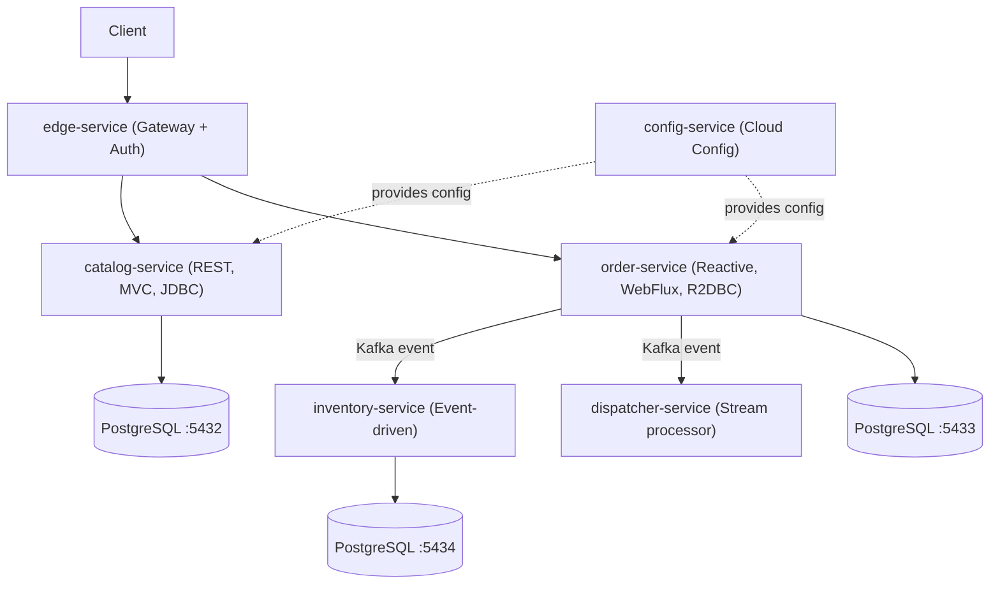

# 🎯 Lộ Trình Senior Java/Spring — spring-native-bookstore

> **Mục tiêu:** Trở thành Senior Java/Spring Developer bằng cách thực hành thực tế trên dự án này.
> **Thời gian ước tính:** 3–6 tháng (tùy tốc độ học)
> **Triết lý:** Học qua việc xây dựng, phá vỡ, sửa chữa và refactor — không học chay lý thuyết.

---

## 📊 Tổng Quan Hệ Thống Hiện Tại

**Stack hiện tại:** Java 21, Spring Boot 4.0.3, Spring Cloud 2025.1.0, Kafka, PostgreSQL, Testcontainers, jOOQ, Flyway, K8s, Skaffold.

---

## 🗺️ 5 Giai Đoạn Học

### Giai Đoạn 1 — Nắm Vững Nền Tảng (2–3 tuần)
- [ ] **1.1 Chạy Toàn Bộ Stack Local:** `make infra-up`, `make run-config`, `make run-catalog`, `make run-order`.
- [ ] **1.2 Đọc Architecture:** Hiểu Hexagonal Architecture trong `order-service` (Domain, Application, Adapter, Bootstrap).
- [ ] **1.3 Viết Unit Tests:** Viết thêm unit tests cho `Order` domain class (invariants, status transitions).

### Giai Đoạn 2 — Hoàn Thiện inventory-service (3–4 tuần)
- [ ] **2.1 Domain Layer:** Thực hiện quy tắc reservation (all-or-nothing, đủ stock).
- [ ] **2.2 Persistence (jOOQ):** Viết Flyway migration, implement repository với jOOQ, xử lý concurrency.
- [ ] **2.3 Event Consumer:** Nhận và xử lý Kafka events (`order-accepted`, `order-cancelled`).
- [ ] **2.4 Integration Tests:** Sử dụng Testcontainers để test DB và Kafka.

### Giai Đoạn 3 — Senior Patterns & Production Readiness (3–4 tuần)
- [ ] **3.1 Resilience:** Thêm Circuit Breaker, Retry, Timeout với Resilience4j.
- [ ] **3.2 Observability:** Structured logging, Distributed tracing (Zipkin), Custom Metrics.
- [ ] **3.3 Security:** JWT validation, Role-based access control với Keycloak.
- [ ] **3.4 Performance:** Giải thích truy vấn (EXPLAIN ANALYZE), tuning connection pool.
- [ ] **3.5 Event-Driven:** Outbox pattern, Saga pattern (xử lý rollback đơn hàng).

### Giai Đoạn 4 — DevOps & Cloud Native (2–3 tuần)
- [ ] **4.1 K8s:** Viết manifests cho inventory-service, cấu hình HPA, Network Policies.
- [ ] **4.2 CI/CD:** Tạo GitHub Actions pipeline tự động lint, test, build và deploy.
- [ ] **4.3 Config:** Secrets management, config refresh không downtime.

### Giai Đoạn 5 — Architect Thinking (Liên tục)
- [ ] **5.1 ADRs:** Viết tài liệu ghi lại lý do chọn các công nghệ/kiến trúc hiện tại.
- [ ] **5.2 Code Review:** Refactor `catalog-service` sang Hexagonal Architecture.
- [ ] **5.3 Scaling:** Tính toán và tối ưu hóa hệ thống để chịu tải cao hơn.

---

## 📈 Tracker Tiến Độ

| Giai đoạn | Milestone chính | Trạng thái |
|-----------|-----------------|------------|
| 1 | Stack chạy được local + hiểu code | ⬜ Chưa bắt đầu |
| 2 | inventory-service hoàn thiện | ⬜ Chưa bắt đầu |
| 3 | Resilience + Observability + Security | ⬜ Chưa bắt đầu |
| 4 | CI/CD + K8s production-ready | ⬜ Chưa bắt đầu |
| 5 | ADRs + Refactor catalog | ⬜ Chưa bắt đầu |

---

## 🔥 Bài Tập "Boss Level"
- **Lv 1:** Vẽ sequence diagram luồng xử lý đơn hàng từ A-Z mà không nhìn code.
- **Lv 2:** Tự xây dựng lại `inventory-service` từ con số 0 trên một branch mới.
- **Lv 3:** Cố tình "phá hoại" một service (kill process) và dùng tracing để tìm lỗi.
- **Lv 4:** Deploy toàn bộ lên Minikube và chạy Load Test bằng k6.
- **Lv 5:** Refactor `catalog-service` đạt coverage > 80% với kiến trúc mới.
